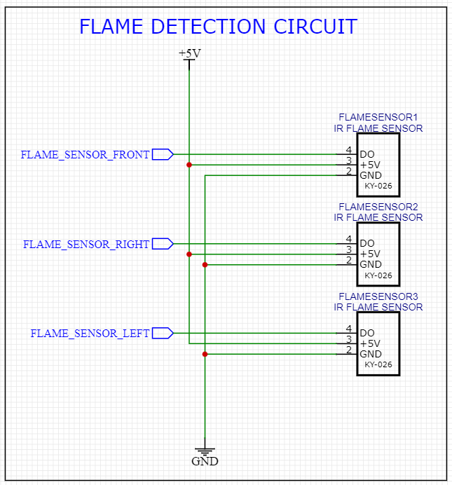

# Firefighting Robot (FIFIRO)

## Overview
This is a 4-wheeled fire fighting robot equipped with a 2-kg fire extinguisher for fire suppression. It can function autonomously by receiving guidance from three flame sensors looking for fire. It can also be controlled remotely using an Android App developed using MIT App Inventor 2 (AI2). 

## Hardware

### Main Components 
1. Arduino Mega
2. HC-05 Bluetooth Module
3. IR Flame Sensor 
4. Relay Module
5. Linear Actuator 
6. Battery
7. Full Metal Gear Set Motor
8. Geared DC Motor
9. Metal Wheel
### Schematic 

1. L298N Motor Driver + Geared DC Motor 

2. Linear Actuator + BTS7960 MOTOR DRIVER

3. IR Flame Sensor

4. Obstacle Avoidance Circuit

## Software

### Algorithm 

### Mobile App

#### Designer 

#### Blocks

### Controller Board

### Configuration File

### Libraries used

### Functions

## User Manual

